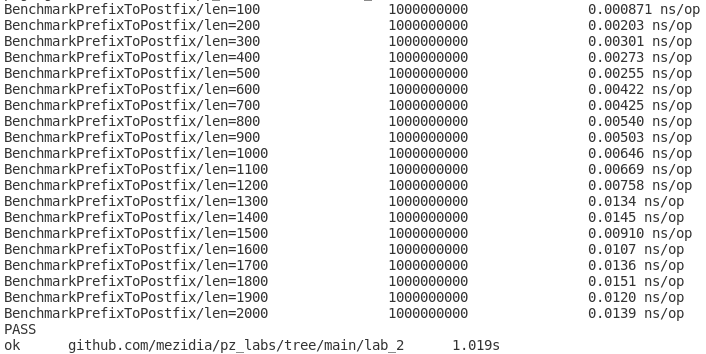
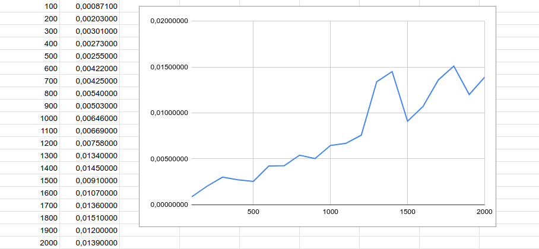

# Звіт #
## Завдання 1 ##
### Текст завдання: ###
*Для 2-гої роботи, підтвердьте лінійний час виконання вашої функції перетворення
чи обчислення вхідного виразу.*  
Для того аби підтвердити лінійний час виконання функції *PrefixToPostfix* робимо бенчмарк, який 20 разів викликає її, заміряючи час виконання.  
Відповідно в середину функції передаємо рядок, який збільшується на l рівних фрагментів кожної ітерації.  
Аби виміряти час функції запускаємо бенчмарки на одному ядрі процесора, щоб уникнути паралельного обчислення.
Результат наведений нижче.  

  

Графік по отриманим результатам тільки нагадує пряму, тому що результати бенчмарків залежать від фонових процесів. Вибірка також є не великою, що впливає на "пряму". Однак звідси видно залежність => він наближається до прямої.  

  

2  
3  
