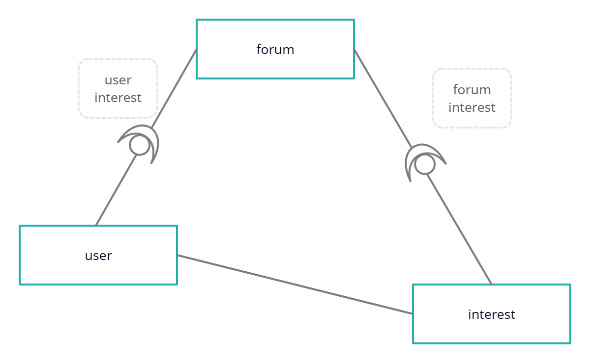
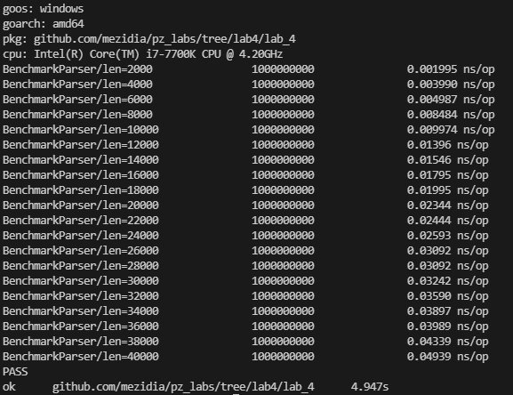
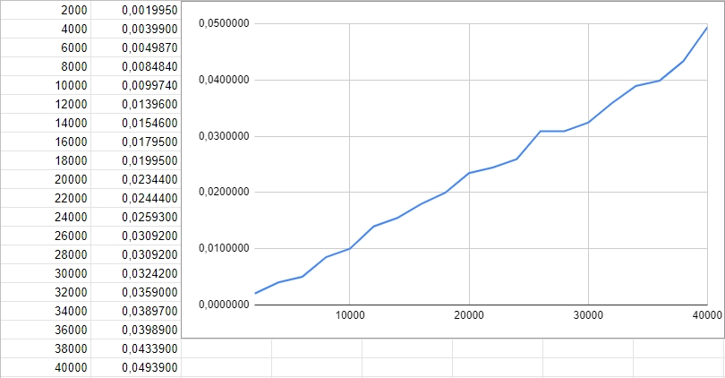
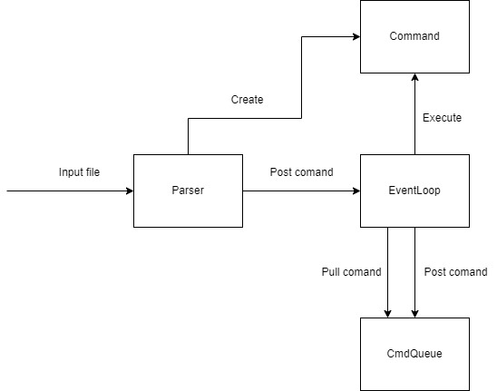

# Звіт #
## Завдання 1 ##
### Текст завдання: ###
*Для 2-гої роботи, підтвердьте лінійний час виконання вашої функції перетворення
чи обчислення вхідного виразу.*  
### Виконання: ###  
Для того аби підтвердити лінійний час виконання функції *PrefixToPostfix* робимо бенчмарк, який 20 разів викликає її, заміряючи час виконання.  
Відповідно в середину функції передаємо рядок, який збільшується на l рівних фрагментів кожної ітерації.  
Аби виміряти час функції запускаємо бенчмарки на одному ядрі процесора, щоб уникнути паралельного обчислення.
Результат наведений нижче.  

  

Графік по отриманим результатам тільки нагадує пряму, тому що результати бенчмарків залежать від фонових процесів. Вибірка також є не великою, що впливає на "пряму". Однак звідси видно залежність => він наближається до прямої.  

  

## Завдання 2 ##
### Текст завдання: ###
*Для 3-тої роботи, побудуйте діаграму взаємодії компонентів у вашій
імплементації.
### Виконання: ###  
Зображено компоненти Форум, Користувач та Інтереси, а також зв'язок користувача з форумом через інтерес. 

## Завдання 3 ##
### Текст завдання: ###
*Для 4-ої роботи, побудуйте діаграму взаємодії для вашої реалізації (на ній, скоріш
за все, мають опинитися компоненти парсера, черги команд, ядра цикла) та
підтвердьте лінійний час роботи вашого парсера команд.*
### Виконання: ###  
Для підтвердження лінійного часу виконання ми зробили бенчмарк який запускає парсер мільйярд разів, вимірюючи час виконання. Як файл для парсингу на кожній ітерації ми створювали
текстовий файл команд, збільшуючи кількість команд на певний крок (2000) на кожній ітерації. Окремо винесли змінну, куди зберігаємо результати парсера, щоб наші виклики не були оптимізовані. Бенчмарки запускалися на одному ядрі процесора, щоб точно вимірятии час виконання та уникнути проблем з доступом до файлу. Збільшуючи на однакову кількість однакових команд наш файл ми зможемо простежити настільки більше часу потрібно парсеру для обробки файлу. Ми повинні довести що цей час є лінійним, тож зробимо 20 ітерацій та побудуємо графік за знайденими точками. Навіть виконуючи подібні бенчмарки в лабараторних умовах, в нас все ж працює операційна система й існує купа фонових процесів що так чи інакше впливають на час виконання, тож графік не може бути абсолютно лінійним, але він повинен бути паближено схожий.

Другою частиною завдання було створити діаграму взаємодії, де ми визначили ключові сутності нашої системи та яким чином вони взаємодіють між собою. В даному випадку ми виокремили також 2 інтерфейси це Handler та Command.

